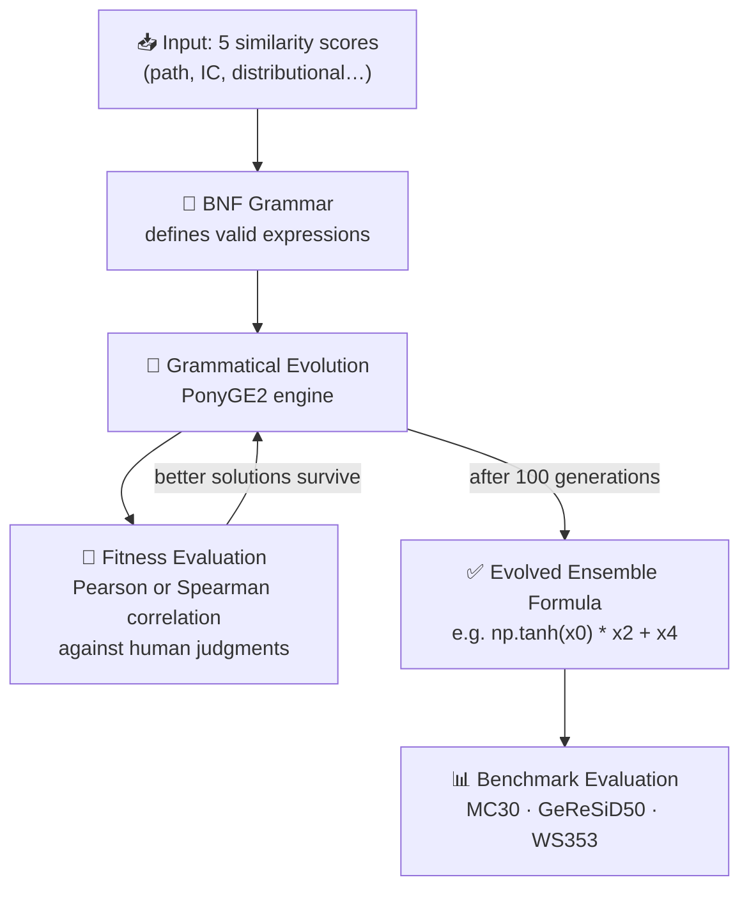

<div align="center">

# 🧬 SeSiGE

### *Semantic Similarity via Grammatical Evolution*

**Automatically evolving optimal ensembles of semantic similarity measures — no hand-crafting required.**

[](https://arxiv.org/abs/2307.00925)
[](https://www.sciencedirect.com/science/article/pii/S1568494626019344)
[](https://opensource.org/licenses/MIT)
[](https://www.python.org/)
[](https://github.com/PonyGE/PonyGE2)

</div>

---

## 🌟 What Is This?

Measuring semantic similarity is a fundamental challenge in NLP. Individual similarity measures (path-based, information-content, distributional) each capture different aspects of meaning — but [...] 

**SeSiGE answers this automatically.**

This repository accompanies the paper [**"Automatic Design of Semantic Similarity Ensembles Using Grammatical Evolution"**](https://arxiv.org/abs/2307.00925), which has now been **accepted and published in Applied Soft Computing**: [https://www.sciencedirect.com/science/article/pii/S1568494626019344](https://www.sciencedirect.com/science/article/pii/S1568494626019344). It introduces a **Grammatical Evolution** approach to automatically design semantic similarity ensembles.

- 🎯 **Outperform hand-crafted baselines** on standard benchmarks
- 🔍 **Remain fully interpretable** — the evolved formula is human-readable
- ⚡ **Require zero domain expertise** to tune — evolution handles it

---

## ✨ Key Contributions

| Contribution | Description |
|---|---|
| 🥇 **Novel Application** | First use of Grammatical Evolution for semantic similarity ensemble design |
| 🔀 **Dynamic Aggregation** | Automatically discovers which measures to combine and how |
| 📐 **Dual Optimization** | Supports both Pearson (PCC) and Spearman (SRCC) correlation targets |
| 🗺️ **Cross-Domain Validation** | Evaluated on general NLP (MC30, WS353) *and* geospatial (GeReSiD50) datasets |
| 🧩 **Grammar-Guided Search** | BNF grammars constrain the search space to syntactically valid, meaningful expressions |

---

## 🏗️ How It Works



### The Core Idea

The evolution searches over the space of mathematical expressions defined by a **Backus-Naur Form (BNF) grammar**. Each individual in the population encodes a candidate formula combining up to 5 pre-computed semantic similarity features.

**Example evolved expression:**

```python
# A formula automatically discovered by GE on the MC30 dataset
np.tanh(x2) * x0 + x3 * 0.47
```

This is the entire "model" — fully transparent and deployable in a single line.

---

## 📁 Repository Structure

```
sesige/
├── datasets/               # Benchmark datasets (train/validation splits)
│   ├── mc-training.txt         # MC30 — 30 classic word pairs
│   ├── mc-validation.txt
│   ├── geresid-training.txt    # GeReSiD50 — geospatial phrase pairs
│   ├── geresid-validation.txt
│   ├── ws353-training.txt      # WS353 — 353 general word pairs
│   └── ws353-validation.txt
├── grammars/               # BNF grammars guiding the search
│   ├── ge.bnf                  # Numeric expression grammar (regression mode)
│   ├── gei-pearson-mc.pybnf    # Python-level grammar targeting Pearson / MC30
│   ├── gei-pearson-geresid.pybnf
│   ├── gei-pearson-ws353.pybnf
│   ├── gei-spearman-mc.pybnf   # Python-level grammar targeting Spearman / MC30
│   ├── gei-spearman-geresid.pybnf
│   └── gei-spearman-ws353.pybnf
├── parameters/             # PonyGE2 experiment configurations
│   ├── ge-pearson-mc.txt       # GE mode, Pearson, MC30
│   ├── ge-spearman-mc.txt      # GE mode, Spearman, MC30
│   ├── gei-pearson-mc.txt      # GEI mode (Python grammar), Pearson, MC30
│   └── ...                     # (all dataset × metric × mode combinations)
└── src/
    ├── fitness/
    │   └── pymax.py            # Fitness function for Python-grammar GEI mode
    └── utilities/
        └── fitness/            # Shared regression fitness utilities
```

---

## 🛠️ Installation

### Prerequisites

- Python 3.8+
- NumPy, SciPy, pandas

### Steps

1. **Clone PonyGE2** (the evolutionary engine):
   ```bash
   git clone https://github.com/PonyGE/PonyGE2.git
   ```

2. **Clone this repository**:
   ```bash
   git clone https://github.com/jorge-martinez-gil/sesige.git
   ```

3. **Overlay SeSiGE files onto PonyGE2**:
   ```bash
   cp -r ./sesige/* ./PonyGE2/
   ```
   > This adds the grammars, datasets, parameters, and custom fitness functions into the PonyGE2 directory tree.

4. **Install dependencies**:
   ```bash
   cd PonyGE2
   pip install -r requirements.txt
   ```

---

## ⚙️ Usage

Navigate to the PonyGE2 `src` directory and launch an experiment using any of the provided parameter files.

### Running a single experiment

```bash
cd ./PonyGE2/src

# Evolve an ensemble optimized for Pearson correlation on MC30
python ponyge.py --parameters ge-pearson-mc.txt

# Evolve for Spearman correlation on WS353
python ponyge.py --parameters ge-spearman-ws353.txt

# Use Python-level grammar (GEI mode) for Pearson on GeReSiD50
python ponyge.py --parameters gei-pearson-geresid.txt
```

### Available configurations

| Parameter File | Grammar Mode | Metric | Dataset |
|---|---|---|---|
| `ge-pearson-mc.txt` | GE (numeric) | Pearson | MC30 |
| `ge-spearman-mc.txt` | GE (numeric) | Spearman | MC30 |
| `ge-pearson-geresid.txt` | GE (numeric) | Pearson | GeReSiD50 |
| `ge-spearman-geresid.txt` | GE (numeric) | Spearman | GeReSiD50 |
| `ge-pearson-ws353.txt` | GE (numeric) | Pearson | WS353 |
| `ge-spearman-ws353.txt` | GE (numeric) | Spearman | WS353 |
| `gei-pearson-mc.txt` | GEI (Python) | Pearson | MC30 |
| `gei-spearman-mc.txt` | GEI (Python) | Spearman | MC30 |
| `gei-pearson-geresid.txt` | GEI (Python) | Pearson | GeReSiD50 |
| `gei-spearman-geresid.txt` | GEI (Python) | Spearman | GeReSiD50 |
| `gei-pearson-ws353.txt` | GEI (Python) | Pearson | WS353 |
| `gei-spearman-ws353.txt` | GEI (Python) | Spearman | WS353 |

### Key evolutionary parameters

| Parameter | Value | Description |
|---|---|---|
| `POPULATION_SIZE` | 100 | Individuals per generation |
| `GENERATIONS` | 100 | Number of generations |
| `CROSSOVER` | `variable_onepoint` | Crossover operator |
| `CROSSOVER_PROBABILITY` | 0.8 | Probability of crossover |
| `MUTATION` | `int_flip_per_codon` | Mutation operator |
| `SELECTION` | `tournament` (size 2) | Selection strategy |
| `INITIALISATION` | `PI_grow` | Population initialization |

---

## 📈 Datasets

Each dataset provides 5 pre-computed similarity features (`x0`–`x4`) derived from different semantic similarity measures, plus a human-annotated ground-truth score.

| Dataset | Pairs | Domain | Split |
|---|---|---|---|
| **MC30** | 30 | General NLP (classic word pairs) | 20 train / 10 val |
| **GeReSiD50** | 50 | Geospatial NLP (place & concept pairs) | 35 train / 15 val |
| **WS353** | 353 | General NLP (broad vocabulary) | 248 train / 105 val |

---

## 🧪 Experimental Results

GE-based ensembles evaluated against state-of-the-art genetic methods (**LGP** = Linear Genetic Programming) using **Pearson (PCC)** and **Spearman (SRCC)** correlation with human judgments:

| Dataset | Metric | **GE (ours)** | State-of-the-Art (LGP) | Δ |
|---|---|:---:|:---:|:---:|
| MC30 | PCC | 0.794 | 0.845 | –0.051 |
| MC30 | SRCC | **0.859** | 0.822 | **+0.037** ✅ |
| GeReSiD50 | PCC | 0.743 | 0.756 | –0.013 |
| GeReSiD50 | SRCC | **0.779** | 0.752 | **+0.027** ✅ |
| WS353 | PCC | **0.827** | 0.817 | **+0.010** ✅ |
| WS353 | SRCC | **0.817** | 0.817 | 0.000 ✅ |

> ✅ = GE matches or exceeds the state-of-the-art baseline.
> GE achieves competitive or superior ranking-based (SRCC) performance across all datasets.

---

## 📚 Citation

If SeSiGE contributes to your research, please cite:

```bibtex
@article{martinezgil2027,
    title = {Automatic design of semantic similarity ensembles using grammatical evolution},
    journal = {Applied Soft Computing},
    volume = {204},
    pages = {116486},
    year = {2027},
    issn = {1568-4946},
    doi = {https://doi.org/10.1016/j.asoc.2026.116486},
    url = {https://www.sciencedirect.com/science/article/pii/S1568494626019344},
    author = {Jorge Martinez-Gil},
}
```

---

## 🤝 Contributing

Contributions are welcome! Ideas for extending this work:

- 🔢 **More similarity measures** — add features beyond `x0`–`x4`
- 🌐 **New datasets** — multilingual or domain-specific benchmarks
- 🧬 **Alternative grammars** — richer expression structures
- 📦 **Standalone packaging** — decouple from PonyGE2 for easier deployment

Please open an issue or pull request to get started.

---

## 📄 License

This project is licensed under the **MIT License** — see [LICENSE](LICENSE) for details.
